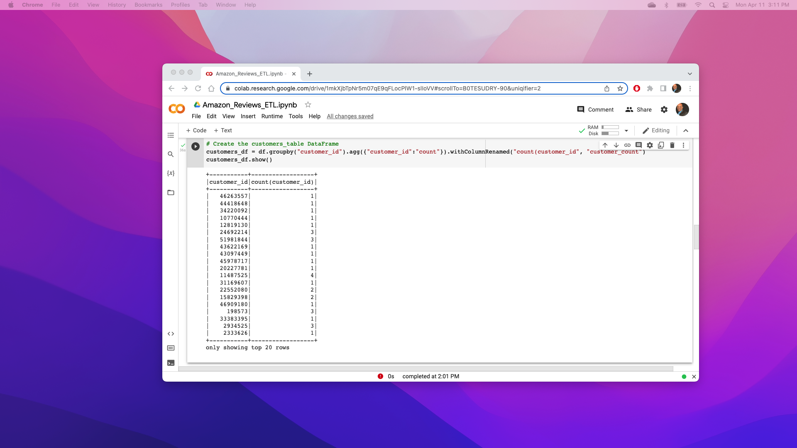
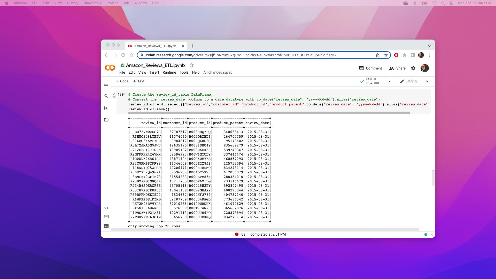
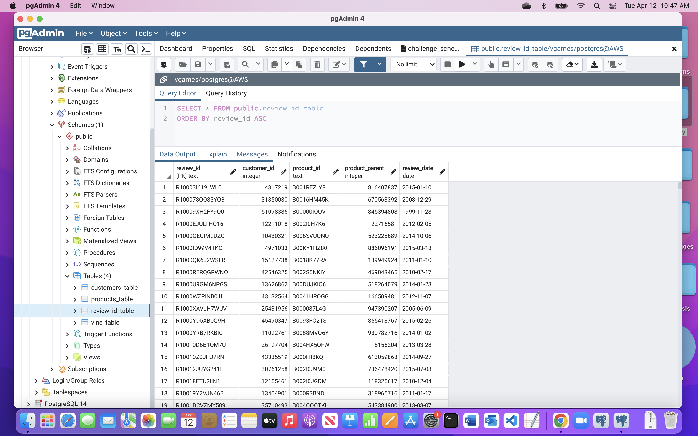
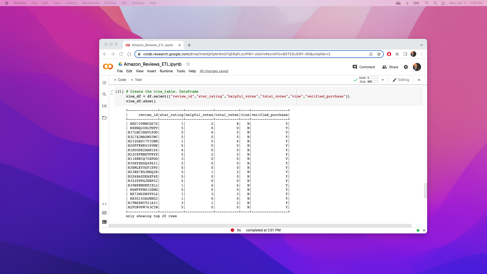
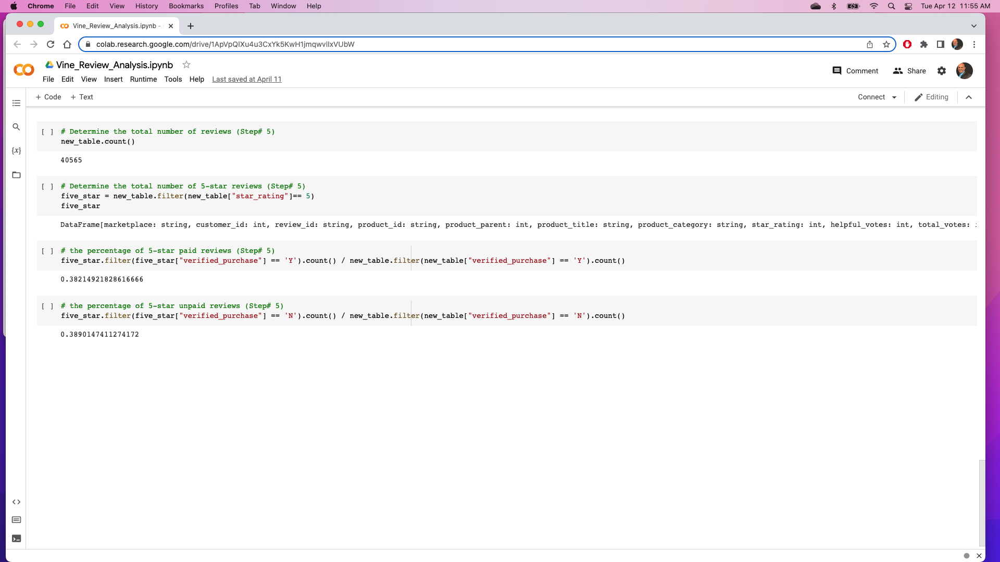

# Amazon_Vine_Analysis

## Overview of the analysis: 
This project is to analysis Amazon Vine program and determine the difference between Vine reviews and Non-Vine reviews.
Using PySpark, perform extract, transform and load (ETL), connect to AWSRDS instance to load into pgAdmin.
I have selected to get the data for the Video Games.

## Results
## The customers table DataFrame

## The products table DataFrame

## The review id table DataFrame

## The vine_table DataFrame

## Total members reviews

## Summary:

As per total members review five star, paid and unpaid reviews not much positive bias because the all around 38%. Same analysis for vine program, it does not show any bias.
